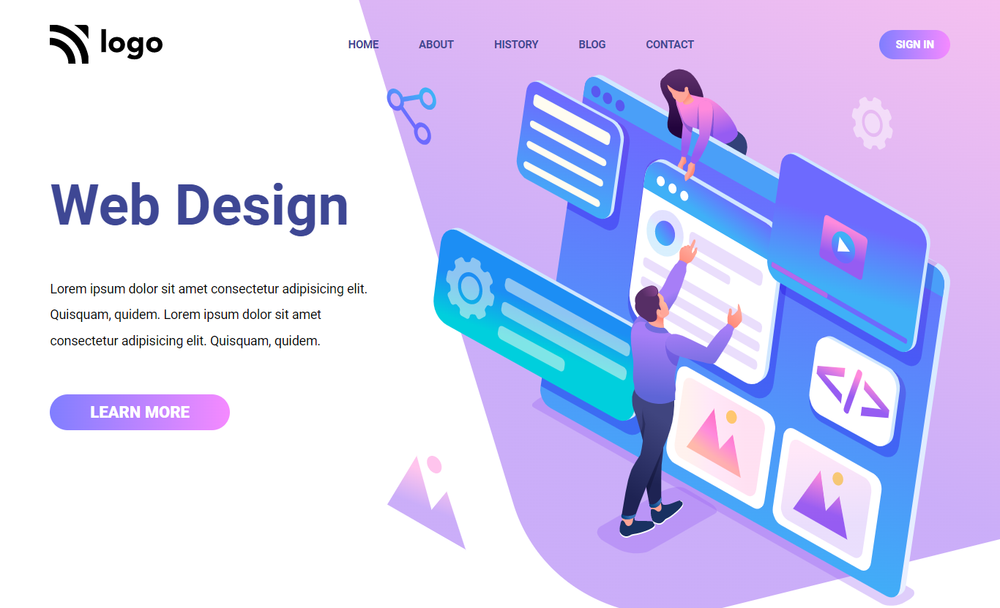

# Project 8

## Web Design Landing Page

### 🖥️ A Landing Page of Web Design Agency.📱

  

#### Built Using HTML & CSS (Desktop💻 & Mobile📱 View Only)

#### Time Taken to finish the Project - 3 hours ⌛ (approx)

---

## Things learned from project -

- 
- 
- 
- 

---

## Live Demo [Demo](https://manas-ranjan-murmu-project8.netlify.app/)

### Screenshot

---
